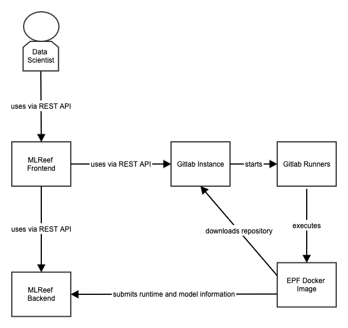

# MLReef Architecture

Architecture and Planning documents for the whole platform. These diagrams follow the [C4](https://c4model.com/) Style of Software Architecture.

The diagrams are created with the free tool Gliffy. Gliffy is available as Chrome Extension [here](https://chrome.google.com/webstore/detail/gliffy-diagrams/bhmicilclplefnflapjmnngmkkkkpfad/related?hl=en).

## Container Level

