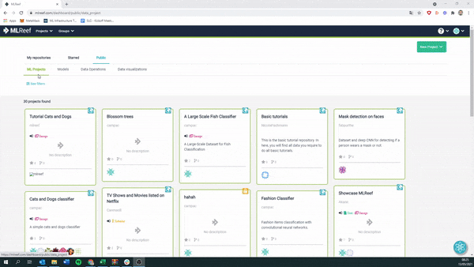
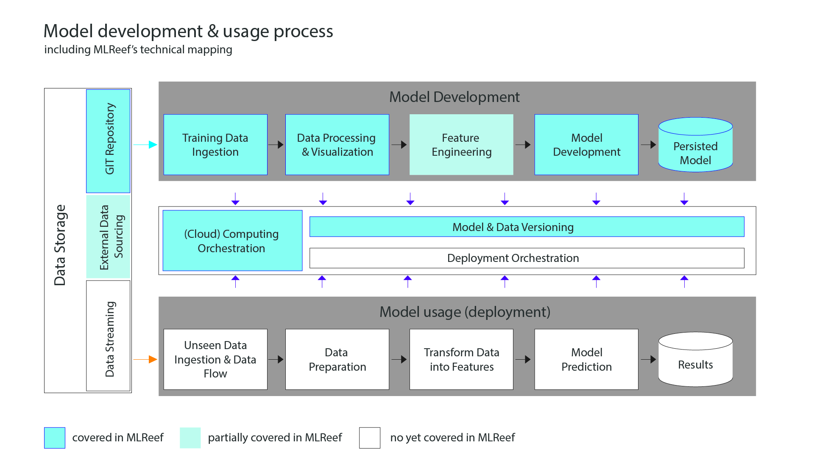

<div align="center">

<a href="https://mlreef.com"></a>


**The collaboration platform for Machine Learning**

**MLReef is an open source ML-Ops platform that helps you collaborate, reproduce and share your Machine Learning work with thousands of other users.**
   
 **IMPORTANT: We are no longer supporting and updating this repository. We are still actively working on this project but on our main repo at GitLab**. 

</div>

---
### MLReef
MLReef is a ML/DL development platform containing four main sections:

- [Data-Management](#data-management) - Fully versioned data hosting and processing infrastructure
- [Publishing code repositories](#publishing-code) - Containerized and versioned script repositories for immutable use in data pipelines
- [Experiment Manager](#experiment-manager) - Experiment tracking, environments and results
- [ML-Ops](#ml-ops) - Pipelines & Orchestration solution for ML/DL jobs (K8s / Cloud / bare-metal)  

---
<div align="center">

**[Sign up](https://mlreef.com/register)  &  [start experimenting](https://docs.mlreef.com/) in minutes.**  

</div>

---

To find out more about how MLReef can streamline your Machine Learning Development Lifecycle visit [our homepage](https://www.mlreef.com)

## Data Management

<a href="https://www.mlreef.com"></a>

* Host your data using git / git LFS repositories.
    * Work concurrently on data 
    * Fully versioned or LFS version control
    * Full view on data processing and visualization history
* Connect your external storage to MLReef and use your data directly in pipelines
* Data set management (access, history, pipelines)

## Publishing Code

**Adding your params via argparse...**

```python
# Example params for a ResNet50 script
def process_arguments(args):
    parser = argparse.ArgumentParser(description='ResNet50')
    parser.add_argument('--input-path', action='store', help='path to directory of images')
    parser.add_argument('--output-path', action='store', default='.', help='path to output metrics')
    parser.add_argument('--height', action='store', default=224, help='height of images (int)')
    parser.add_argument('--width', action='store', default=224,help='width of images (int)')
    parser.add_argument('--channels', action='store', default=3, help='channels of images: 1 = grayscale, 3 = RGB ,'
                                                                      '4=RGBA (int)')
    parser.add_argument('--use-pretrained', action='store', default=True, help='use pretrained ResNet50 weights (bool)')
    parser.add_argument('--epochs', action='store',default=5, help='number of epochs for training')
    parser.add_argument('--batch-size', action='store', default=32, help='batch size fed to the neural network (int)')
    parser.add_argument('--validation-split', action='store', default=.25, help='fraction of images to be used for '
                                                                                'validation (float)')
    parser.add_argument('--class-mode', action='store', default='binary', help='"categorical", "binary", "sparse",'
                                                                                    ' "input", or None')
    parser.add_argument('--learning-rate', action='store', default=0.0001,
                        help='learning rate of Adam Optimizer (float)'
                             '')
    parser.add_argument('--loss', action='store', default='sparse_categorical_crossentropy', help='loss function used to'
                                                                                           ' compile model')
    params = vars(parser.parse_args(args))
    return params
```
**...and publishing your scripts gets you the following:**

* Containerization of your scripts
    * Always working scripts including easy hyperparameter access in pipelines
    * Execution environment (including specific packages & versions)
    * Hyper-parameters
        * ArgParser for command line parameters with currently used values
        * Explicit parameters dictionary
        * Input validation and guides
* Multiple containers based on version and code branches

## Experiment Manager

* Complete experiment setup log
    * Full source control info including non-committed local changes
    * Execution environment (including specific packages & versions)
    * Hyper-parameters
* Full experiment output automatic capture
    * Artifacts storage and standard-output logs
    * Performance metrics on individual experiments and comparative graphs for all experiments
    * Detailed view on logs and outputs generated
* Extensive platform support and integrations
    * Supported all python based ML/DL frameworks, for example: [PyTorch](https://pytorch.org/), [Tensorflow](https://www.tensorflow.org/), [Keras](https://keras.io/) or [Scikit-Learn](https://scikit-learn.org/stable/index.html)

## ML-Ops

* Concurrent computing pipelining
* Governance and control
    * Access and user management
    * Single permission management 
    * Resource management
* Model management

MLReef Architecture
--------------------

The MLReef ML components within the ML life cycle:

* Data Storage components based currently on Git and Git LFS.
* Model development based on working modules (published by the community or your team), data management, data processing / data visualization / experiment pipeline on hosted or on-prem and model management.
* ML-Ops orchestration, experiment and workflow reproducibility, and scalability.

<a></a>


Why MLReef?
--------------------

MLReef is our solution to a problem we share with countless other researchers and developers in the machine learning/deep learning universe: Training production-grade deep learning models is a tangled process. MLReef tracks and controls the process by associating code version control, research projects, performance metrics, and model provenance. 

We designed MLReef on best data science practices combined with the knowleged gained from DevOps and a deep focus on collaboration. 

* Use it on a daily basis to boost collaboration and visibility in your team
* Create a job in the cloud from any code repository with a click of a button
* Automate processes and create pipelines to collect your experimentation logs, outputs, and data
* Make you ML life cycle transparent by cataloging it all on the MLReef platform

<a href="https://www.mlreef.com"></a>


Getting Started as a Developer
--------------------
- Please read the [Contribution Guidelines](CONTRIBUTE.md) carefully
- clone the [mlreef git repository](https://gitlab.com/mlreef/mlreef) to your local machine
- read the [architecture document](https://docs.mlreef.com/99-development/architecture.md)

**To start developing, continue with the [developer guide](developer_guide.md)**

### Canonical source

The canonical source of MLReef where all development takes place is hosted on [gitLab.com/mlreef/mlreef](http://gitlab.com/mlreef/mlreef).

License
--------------------
MIT License (see the [License](LICENSE.md) for more information)

Documentation, Community and Support
--------------------
More information in the [official documentation](http://doc.mlreef.com) and on [Youtube](https://www.youtube.com/channel/UCTRuKZs136dOtzG95f79TKA).

For examples and use cases, check these use cases or start the tutorial after registring: 
* [Recommending netflix movies and tv shows](https://mlreef.com/erikaml/recommending-netflix-movies-and-tv-shows)
* [Recognizing handwritten digits](https://mlreef.com/erikaml/recognize-handwritten-digits)
* [Painting like Monet](https://mlreef.com/Akane/painting-like-monet)

If you have any questions: post on our [Slack channel](https://app.slack.com/client/TSQQH4MT6/CSF2J5UPK), or tag your questions on stackoverflow with 'mlreef' tag.

For feature requests or bug reports, please use [GitLab issues](https://gitlab.com/mlreef/mlreef/-/issues).

Additionally, you can always reach out to us via hello@mlreef.com

Contributing
--------------------

**Merge Requests are always welcomed** :heart: See more details in the MLReef [Contribution Guidelines](CONTRIBUTE.md).
