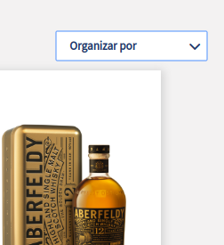
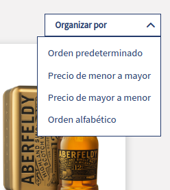

Dropdown
===

* Mobile first, ui component based on Vue.
* Use:
```js
  <Dropdown :label="Organizar por" :items="items" />
```

### Template
```html
<template lang="html">
  <div :class="{'l-dropdown': true, 'collapsed': isCollapsed}">
    <button @click="toggleShow" class="l-dropdown-button">
      <span class="l-dropdown-button-title">
        {{ label }}
      </span>
      <span class="licorera-icon-right-arrow js-arrow-dropdown"></span>
    </button>
    <div class="l-dropdown-menu">
      <ul @click="isCollapsed = !isCollapsed" class="l-dropdown-list">
        <li v-for="(item, index) in items"
          :key="'dropdown-' + index"
          class="l-dropdown-list-item"
          @click="item.action">
          {{ item.name }}
        </li>
      </ul>
    </div>
  </div>
</template>
```

### Script
```js
export default {
  props: {
    label: {
      type: String,
      required: true
    },
    items: {
      type: Array,
      required: true,
      validator: items => items.every(i => i.name && i.action)
    }
  },

  data: () => ({
    isCollapsed: true
  }),

  methods: {
    toggleShow () {
      this.isCollapsed = !this.isCollapsed
    }
  }
}
```

### SCSS
```scss
$transition-time: 0.3s;
$sm: 570px;   // the breakpoint

.l-dropdown {
  position: relative;
  transition: ease 0.5s;
  cursor: pointer;

  // this compile to .l-dropdown-button
  &-button {
    padding: 0.5rem 0.5rem 0.5rem 1rem;
    border: none;
    background-color: #fff;
    color: var(--blue);       // global color
    font-weight: bolder;
    border: solid 1px var(--blue);

    &-title {
      padding-right: 4rem;
      font-size: 110%;
    }

    // this compile to .l-dropdown-button .js-arrow-dropdown
    // defines .js-arrow-dropdown (a foreign class) only inside .l-dropdown-button
    & .js-arrow-dropdown {
      transition: ease $transition-time;
      display: inline-block;
      transform: rotateZ(-90deg);
    }
  }

  &-menu {
    position: absolute;
    box-sizing: border-box;
    z-index: 1;
    right: 0;
    overflow-y: hidden;
    transition: ease $transition-time;
    height: 50vh;     // this is a phantom height for help the animation
    max-height: fit-content;
    background-color: transparent;
    width: max-content;

    // defines desktop behavior (anything elsee is thought for mobile)
    @media screen and (min-width: $sm) {
      height: 200px;
    }
  }

  &-list {
    background-color: #fff;
    border: solid 1px var(--blue);
    padding: 0.5rem 0;

    &-item {
      padding: 0.5rem 1rem;
      color: var(--blue);

      // this compile to .l-dropdown-list-item:hover
      &:hover {
        background-color: var(--gray);
      }
    }
  }

  // defines behavior when is closed (default is open)
  &.collapsed {
    & .l-dropdown {
      &-button {
        border: solid 1px #fff;

        & .js-arrow-dropdown {
          transform: rotateZ(90deg);
          vertical-align: middle;
          margin-bottom: 2px;
        }
      }

      &-menu {
        height: 0;
      }
    }
  }
}
```


## Images


