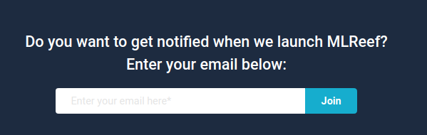
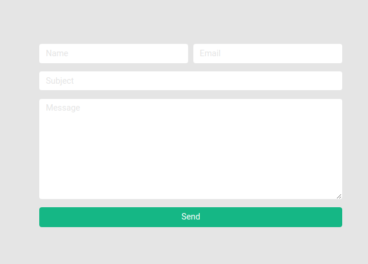

Customizing Twitter Bootstrap
===

How easy is to tune bootstrap appearance to looks like MLReef landing page.

> source: www-mlreef-com repository

`_variables.scss`
```scss
$deep-dark:     #1D2B40;
$signal-fire:   #f5544d;
$almost-white:  #e5e5e5;
$less-white:    #b2b2b2;
$lagoon:        #16ADCE;
$sponge:        #EABA44;
$algae:         #15B785;

$primary:       $deep-dark;
$secondary:     $signal-fire;
$success:       $algae;
$warning:       $sponge;
$info:          $lagoon;
$light:         $almost-white;
$dark:          $deep-dark;

$border-radius:                0.3vw;
$border-radius-lg:            $border-radius;
$border-radius-sm:            $border-radius;

$font-family-sans-serif: Roboto, sans-serif;

$input-border-width: 0;
$input-placeholder-color: $light;
```

`index.scss`
```scss
// fonts
@import url('https://fonts.googleapis.com/css?family=Roboto:400,500,700&display=swap');

// customized variables
@import "variables";

// whole boostrap entrypoint
@import "node_modules/bootstrap/scss/bootstrap.scss";

// icons
@import url('https://use.fontawesome.com/releases/v5.12.0/css/all.css');
```



