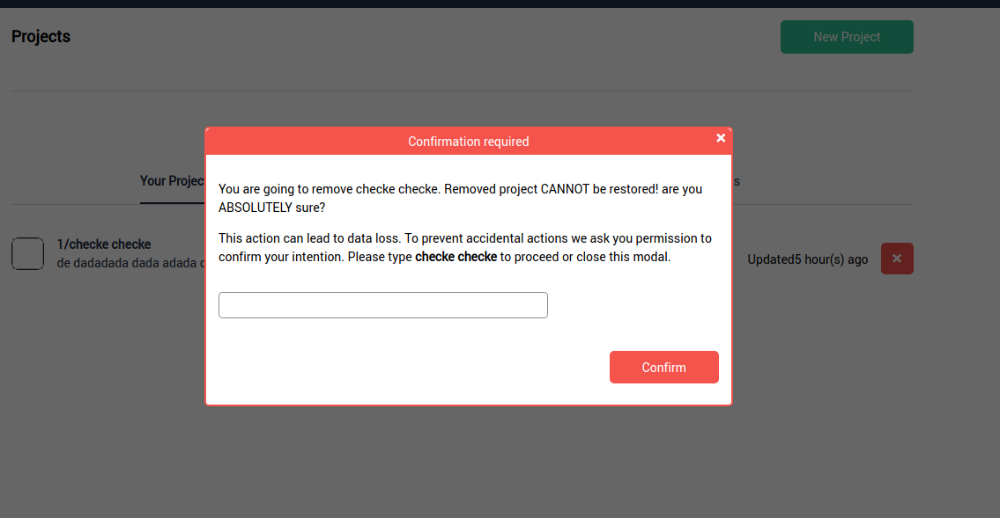

Modal
===

Modal should be placed closer to *body* as possible, avoiding relative positioned elements
between them.

Example:
---

```html
  <div className="modal modal-dark dark-cover">

    <div className="modal-cover"></div> <!-- optional if a cover is needed -->

      <div className="modal-container">
        <!-- close button is placed top right -->
        <div class="modal-container-close">
          <button className="btn btn-icon fa fa-times" />
        </div>

        <div className="modal-header">
          <!-- optional - if the modal needs a header with title -->
        </div>

        <div className="modal-content">
          <!-- whatever content -->
        </div>

        <div className="modal-actions">
          <!-- optional - this is where buttons are placed -->
        </div>
    </div>
  </div>
```

```html
  border and title color: modal-[type] where
  type: primary | secondary | success | danger | info | warning | dark | light
  <div className="modal modal-[type] ...">
    ...
```

```html
defines max-width of modal: modal-[size]
where size: sm | lg
<div className="modal modal-[size] ...">
  ...
```

```html
set a cover opaque: dark-cover
else cover is transparent
<div className="modal dark-cover ...">
  ...
```



