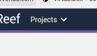
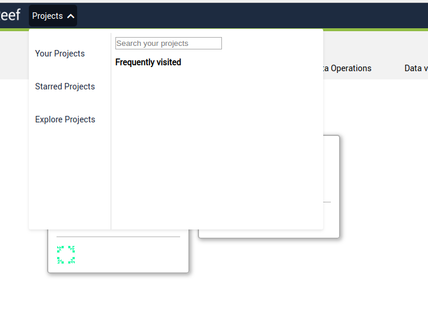

# MDropdown

This is a button that toggle a menu. The menu can be a component, jsx code or a list
of items.

### Props
- **reference** [React.ref]
- **className** [String] optional classes to be appended to the outer div.
- **label** [String|HtmlNode] button label.
- **align** [String] optional align for the menu.
- **listTitle** [String] optional title for the item list.
- **component** [HtmlNode] optional html code to be rendered as menu.
- **onClickClose** [Boolean] if true will close the menu when an option is clicked.
- **buttonClasses** [String] optional classes to customize the button.
- **items** [Array(content)] options for the menu.


## Examples

web/src/components/navbar/navbar.jsx#76
```html
<MDropdown
  className="ml-3 my-auto"
  buttonClasses="btn btn-dark px-1"
  label="Projects"
  component={(
    <div className="project-box">
      <div className="user-projects">
        <p><Link to="/my-projects#personal">Your Projects</Link></p>
        <p><Link to="/my-projects#starred">Starred Projects</Link></p>
        <p><Link to="/my-projects#explore">Explore Projects</Link></p>
      </div>
      <div className="project-search">
        <input
          type="text"
          placeholder="Search your projects"
        />
        <div className="mt-3">
          <b>Frequently visited</b>
        </div>
      </div>
    </div>
  )}
/>
```



