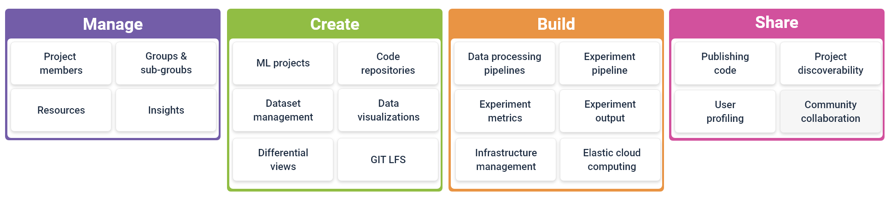

# MLReef - the first true MLOPs platform

MLReef is filling the gap for a true holistic MLOps platform - one, that covers all basic needs for state-of-the-art Machine Learning development. 

The following links provide documentation for each MLOps stage: 

| MLOps stage  | Documentation for  |
|---|---|
| [Create](#create)  | Features to create. |
| [Develop](#develop)  | Pipelines and experiments. |
| [Manage](#manage)  | Projects, users, groups and resources. |
| [Share](#share)  | Releasing code repositories. |

 

###  Create

MLReef consolidates your ML projects in one [distributed version control system](../1-new_to_git.md) that´s easily managed and processed without disrupting your workflow. 

| All create topics  | Documentation for  |
|---|---|
| [ML projects](../../1-repositories/1-ml_projects.md)  | Creating and managing ML projects. |
| [Models](../../1-repositories/2-models.md)  | Creating and managing models. |
| [DataOps](../../1-repositories/3-dataops.md)  | Creating and managing dataOps. |
| [DataVisualization](../../1-repositories/4-data_visualizations.md)  | Creating and managing data visualizations. |
| [MLReef infrastructure](.../../4-infrastructure/0-README.md)  | Understanding MLRee's core infrastructure. |

###  Develop

MLreef is built from ground up to offer the highest degree of collaboration, within your team and throughout the entire MLReef community. The marketplace offers you instant access to ML projects, models and data operations. 

The following documentation relates to the MLOps **develop** stage: 

| All develop topics  | Documentation for  |
|---|---|
| [Data pipelines](../../../1-data_pipelines/0-README.md)  | Data sourced pipelines for data preprocessing and visualization. |
| [Experiments](../../../2-experiments/0-README.md)  | Create experiments based on data with ML models. |
| [Model output](../../../2-experiments/1-model_output.md)  | Metrics and model binary storage and download. |
| [Reproducibility](../2-reproducibility.md)  | Understanding and reproducing each value-added step. |

###  Manage

Manage your Machine Learning pipeline like a pro! Manage users, groups and resources. The following documentation relates to the MLOps **manage** stage: 

| All manage topics  | Documentation for  |
|---|---|
| [Users](../../../3-settings/1-users.md)  | Manage user access and roles in repositories. |
| [Groups](../../../3-settings/2-groups.md)  | Create groups and manage members and repositories of groups. |
| [Resources](../../../3-settings/3-resources.md)  | Manage resource usage for repositories and groups. |

###  Share

Sharing is an essential part in MLReef and focused on sharing know-how and ML content. The elemental part is to share code repositories by releasing them to make them usable for yourself, your team or the entire community. 

The following documentation relates to the MLOps **share** stage: 

| All share topics  | Documentation for  |
|---|---|
| [Releasing code repositories](../../../1-repositories/5-releasing_code_repos)  | Making code repositories available for use. |
| [User profiles](../../../1-repositories/5-releasing_code_repos)  | Share your profile and discover other users. |

