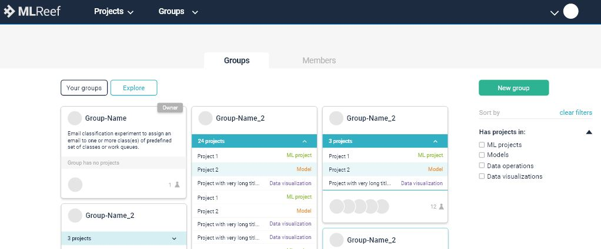
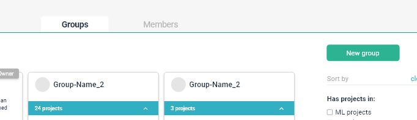
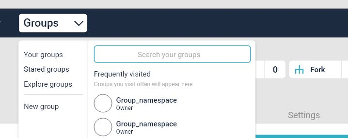

# Groups

With MLReef Groups, you can:

- Assemble related projects together.
- Grant members access to several projects at once.

Find your groups by clicking **Groups > Your Groups** in the top navigation.

The **Groups** page displays:

- All groups you are a member of, when **Your groups** is selected.
- A list of public groups, when **Explore public groups** is selected.

Each group on the **Groups** page is listed with:

- How many projects it contains.
- How many members the group has.
- The group's visibility.
- A link to the group's settings, if you have sufficient permissions.
- A link to leave the group, if you are a member.

## Use cases

You can create groups for numerous reasons. To name a couple:

- Grant access to multiple projects and multiple team members in fewer steps by organizing related projects under the same [namespace](#namespaces) and adding members to the top-level group.
- Make it easier to `@mention` all of your team at once in issues and merge requests by creating a group and including the appropriate members.

For example, you could create a group for your company members. Let's say you create a group called `company-team`.

## Namespaces

In MLReef, a namespace is a unique name to be used as a user name or a group name.

- `http://mlreef.example.com/username`
- `http://mlreef.example.com/groupname`

For example, consider a user named Alex:

1. Alex creates an account on GitLab.com with the username `alex`;
   their profile will be accessed under `https://mlreef.example.com/alex`
2. Alex creates a group for their team with the group name `alex-team`;
   the group and its projects will be accessed under `https://mlreef.example.com/alex-team`

By doing so:

- Any team member mentions Alex with `@alex`
- Alex mentions everyone from their team with `@alex-team`

## Create a new group

To create a new Group, either:

- In the top menu, click **Groups** and then **Your Groups**, and click the green button **New group**:

  

- or directly in the dropdown menu **New group**.

  

Add the following information:

1. The **Group name** will automatically populate the URL. Optionally, you can change it.
   This is the name that displays in group views.
   The name can contain only:
   - Alphanumeric characters
   - Underscores
   - Dashes and dots
   - Spaces
2. The **Group URL** is the namespace under which your projects will be hosted.
   The URL can contain only:
   - Alphanumeric characters
   - Underscores
   - Dashes and dots (it cannot start with dashes or end in a dot)
3. Optionally, you can add a brief description to tell others
   what this group is about.
4. Optionally, choose an avatar for your group.
5. Choose the visibility level (public or private).

