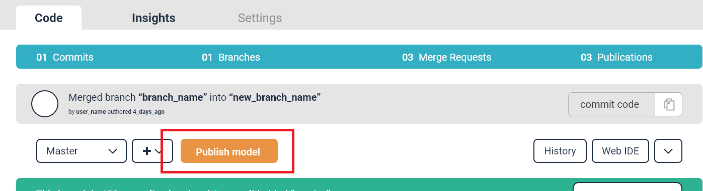
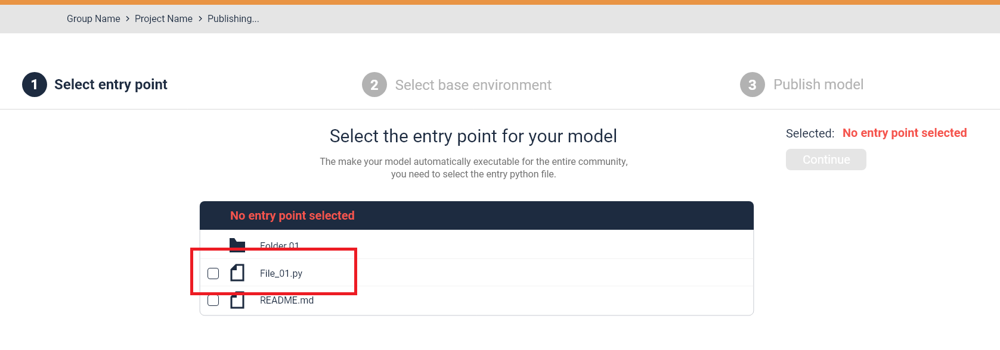

# Publishing a code project

Publishing a code project will containerize your script with all required packages and environment variables and make your function discoverable and usable within the data pipelines in MLReef. Use a model repository to publish a new model (or algorithm) that than can be found and used in the experiment section within a ML project. 

We call a published code repository a code module, as these are modules than you or your team can use atomically in the data pipelines. 

In your code repository you will find a publishing wizard (accessible via the `publish` button).Follow these instructions and start an automatic publishing pipeline to publish your code. 

In order to publish, you will need the following files placed in your `master` branch in your code project: 

- At least **one python file** that serves as an entry point for your ML function. This python file should contain the parameter annotations to make the parameter adjustable later on. 
- A requirements file (named exactly requirements.txt) that describes the libraries (packages) your script requires. Please do not forget to include the version, for example by adding `==1.0` after the package. 

> If your code project (repostory) is set to **private**, the usable code module in the data pipelines will inherit this setting. If only have access to the code repository, then only you will be able to see and use it. 

## What does the publishing process do?

The publishing process will containerize your script. During this process, the annotations will be stored, the packages as described in the `requirements.txt` file will be installed using `pip` and the docker image will be created and published. 

> Every time you push a new change to `master` a new automatic publishing pipeline will start, overwriting your existing image with the new changes. 

**Your script will only be explorable and usable in the data pipelines, when the publishing pipeline succeeded.** This way we can guarantee a qualitative standard for the scripts. 

Once published, it will run through the publishing pipeline creating and registring a docker image with all the scripts, dependencies and environment variables (based on the selected based environment) that it requires. 

Each time you commit to the published `master` branch, a new publication will automatically start. It will again parse your parameters, load any new requirements you specified and it will update the docker image in your registry. This CI/CD approach will also ensure, that your published code project will always stay up-to-date. 
 

## What is required for publishing a code project?

You will need two basic things, a `python file` that is defined as an `entry point` for your script and a `requirements file`. 

In the following section, we will describ these in more detail: 

### Python file

MLReef supports any python scripts to be executed within the data-pipelines in ML projects. To publish a script you need to place the working python file(s) in your master branch (.e.g in your model code repository). 

During the publishing process, you will need to define an entry point. This can be done via the `publishing wizard`: 



When entering the wizard, the initial step is to select your entry point. Select your main python script: 



During the publication process, the python file will be parsed to find your specified parameter annotations. This way, the script will be adjustable by these parameters when you create your data pipelines or experiments later on. 

#### Parameter annotations

Annotations are **non-intrusive** additions to your scripts, they will have no outside effect and require no installation of any further package. To annotate a parameter, you will need to address it in your script. 

**The following annotations are mandatory for every script: data input path and data output path**:

```
    def data_processor(*args, **kwargs):
        pass
        return data_processor


    def parameter(*args, **kwargs):
        pass
        return parameter


    @data_processor(
        name="Add Noise",
        author="MLReef",
        command="im_add_noise",
        type="OPERATION",
        description="This data operation adds noise to an image",
        visibility="PUBLIC",
        input_type="IMAGE",
        output_type="IMAGE"
    )
    @parameter(name="input-path", type="str", required=True, defaultValue="train",
               description="path to directory of images or image file")
    @parameter(name="output-path", type="str", required=True, defaultValue="output",
               description="output directory to save images")
    @parameter(name="mode", type="str", required=True, defaultValue="speckle",
               description="type of noise: gaussian , localvar , poisson , salt , pepper , speckle'")
    def init_params():
        pass
```

You can use the **same annotation format for any other parameter** you want to have access to. 

In addition to the parameter annotations, you will need to include a definition how to process arguments, as following: 

```
def process_arguments(args):
    parser = argparse.ArgumentParser(description='your code project name')
    parser.add_argument('--input-path', action='store', help='path to directory of images')
    parser.add_argument('--output-path', action='store', default='.', help='path to output metrics')
    
    params = vars(parser.parse_args(args))
    return params
```

> Explore how the parameter parsing works in the python parser: backend/mlreef-domain/src/main/kotlin/com/mlreef/parsing/Python3Parser.kt

### Requirements file

You will also need to place a `requirements.txt` file together with your python file in your `master` branch before starting the first publication process. This file will define what packages (and possibly versions) your script requires and will use `pip` to install them in the docker image. This can look like this: 

```
library1
library2==1.0
```

