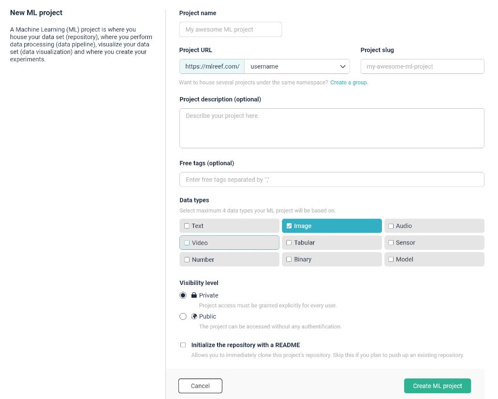
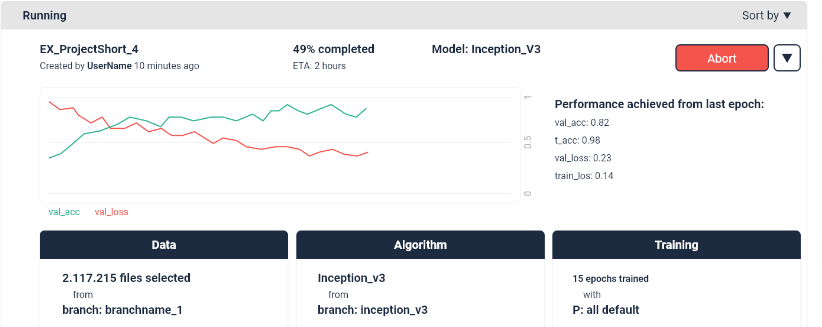

# Early access guide

Hello early-fish!

The following topics should provide you with the basic to start with MLReef:

| Early access documentation | Documentation for |
|---|---|
| [Basic concepts](#basic_concepts)  | Providing you the MLReef basics. |
| [Known limitations](#limitations)  | What is currently NOT possible? |
| [Your contribution](#your_contribution)  | A guide for an enriching early access experience. |

##  Basic concepts

MLReef is a [MLOps](https://en.wikipedia.org/wiki/MLOps) platform for the entire Machine Learning lifecycle. It is based on four major pillars:

*  **Access**: Gain access to community based ML content, from data operations to models.
*  **Efficiency**: Fast iteration, clear and structured workflow with full flexibility.
*  **Reproducibility**: Gain confidence and ownership through full transparency in each step.
*  **Collaboration**: Promoting collaboration within a team and beyond the entire MLReef community.

All concepts and functions in MLReef follow these conceptual pillars.

The following content will provide a fast overview of the major concepts in MLReef:

| Basic concepts | Documentation for |
|---|---|
| [Maturity](#maturity)  | The end-to-end scope of MLReef. |
| [ML project repositories](#project_repos)  | Start your project with a Git based repository. |
| [Processing data](#processing_data)  | Create a data processing pipeline in MLReef. |
| [Visualizing data](#visualizations)  | Create a data visualization pipeline in MLReef. |
| [Experiments and models](#experiments)  | Experiment pipelines and their output. |

###  Maturity

MLReef has a broad scope and vision, and we are constantly iterating on existing and new features. Some stages and features are more mature than others. To convey the state of our feature set and be transparent, we have developed a maturity framework for categories, application types, and stages.

**Planned**: Not yet implemented in MLReef, but on our roadmap.

**Minimal**: A basic foundation for testing and validation.

**Viable**: Used by users and customers to solve real problems.

**Complete**: Contains a competitive feature set sufficient to displace other single-purpose MLOps tools.

| Data management | Experiments | Inference |
|---|---|---|
| **ML project repositories** Minimal | **Model pipelines** Minimal | **Automatic REST deployment** Planned |
|**Data visualization** Minimal|**Experiment metrics** Minimal | |
|**Data processing** Minimal|**Model output** Minimal||
|**Dataset** Minimal|**Cloud execution** Minimal||
|**Data versioning with Git** Minimal|**Local execution** Planned||
|**Storage optimization** Planned|**Hyperparameter optimization** Planned||
|**Data source integrations** Planned|||

###  ML project repositories

A ML project is hosted and managed within a Git based repository. Similar to how traditional software development is managed but with additional ML focused functions.

Your data and your experiments are stored here. Your different ML pipelines can be created within this repository.

You can either create a new project:

or start working based on an existing one via a `fork` or `clone`:

For further documentation, visit the [ML project repository](../User_Documentation) documentation.

###  Processing data

Processing data in MLReef is structured through the [data processing pipeline](../User_Documentation) and completed through atomic [dataset](../User_Documentation).

The following illustration highlights the workflow of processing data in MLReef:

You can access the data processing pipeline within your `data tab` in your ML project repository. To create a processing pipeline, follow these steps:

1.  Enter into the processing pipeline via the blue button `"DataOps"` in data tab.
2.  Select the data you want to process.

    By selecting a folder, all containing files will automatically be selected.

    The data processing pipeline will not change the folder tree structure and the dataset will have the same structure. This can be specially relevant if your labeled your data through folders.

3.  Drag and drop data operations from the right side into the data processing pipeline on the left.

    **Important note:** The order of placing multiple data operations is relevant. The data will flow sub-sequentially through all operations starting by the first.

4.  Change parameters of your data operations by expanding the allocated data operations.

    A parameter can have specific values, input formats or ranges. MLReef automatically validates your input for errors.

    Note: Advanced parameters have a value pre-set and user input is not required.

5.  Execute your data processing pipeline by pressing the "execute" button. This will create your [dataset](1-data_pipelines/0-dataops/1-datasets.md).

###  Data visualizations

Visualizing your data through the data visualization pipeline works very similar to the above described data processing pipeline.

You can access the data visualization pipeline within your `data tab` in your ML project repository. To create a data visualization, follow these steps:

1.  Enter into the data visualization pipeline via the blue button "data visualization" in data tab.
2.  Select the data files you want to visualize.

    By selecting a folder, all containing files will automatically be selected.

3.  Drag and drop data visualizations from the right side into the data visualization pipeline on the left.

    Note: In the data visualization pipeline the order of data visualizations used is NOT relevant. Each data visualization is executed in parallel and they do not have an effect on each other.

4.  Change parameters of your data visualization by expanding the allocated data visualizations.

    A parameter can have specific values, input formats or ranges. MLReef automatically validates your input for errors.

    Note: Advanced parameters have a value pre-set and user input is not required.

5.  Execute your data visualization pipeline by pressing the "execute" button. This will create your [data visualization](1-data_pipelines/1-data_visualization/1-data_visualizations.md).

###  Experiments and models

MLReef has a built-in experiment environment accessed through the `experiment tab` in your ML project repository. In here, you can create new ML experiments with full reproducibility on the underlying data and model.

> Currently, one model for image classification is available, see [FirstDive: "Cats 'n dogs" classification using Resnet50](3-use_cases/1-catsanddogs.md) for a detailed demo on how to use this model.

You can access the experiment pipeline within your `experiment tab` in your ML project repository. To create a data visualization, follow these steps:

1.  Create a new experiment in the `experiment tab`.

2.  Select the data files you want to train your model with.

    By selecting a folder, all containing files will automatically be selected.

    >  Currently, the data split for training and validation is handled only by the `resnet 50` model. You can set the validation percentage in the advanced parameters. No test split is currently done.

3.  Drag and drop the model from the right side into the experiment pipeline on the left.

    Note: In the experiment pipeline the order of models used is NOT relevant. Each model training is executed in parallel and they do not have an effect on each other.

4.  Change parameters of your model by expanding the allocated model.

    A parameter can have specific values, input formats or ranges. MLReef automatically validates your input for errors.

    Note: Advanced parameters have a value pre-set and user input is not required.

5.  Execute your experiment pipeline by pressing the "execute" button. This will create your [experiment entry](2-experiments/0-README.md) in your experiment overview page:

##  Known limitations and problems

MLReef is currently in version `alpha 0.3`. The general aim of this alpha is to test the broad range of functions, such as the data repository and the main three pipelines.

There are many things that are still in development and probably many that still don't work.

Here you can find a list of major features and known problems. This list will continuously be updated.

| Limitation or problem | Description |
|---|---|
| **All projects are found in "explore projects" tab** | New projects and forked projects are always here. Status: doing |
| **Datasets have a copy of original files** | This is due to an error in the config file. Status: doing |
| **Experiment values seem incorrect** | A parsing problem reads only the 5 first epochs. Status: Listed |

##  Your contribution

You can contribute by:

1.  Sending an email to mailto:help@mlreef.com - This will automatically create a ticket in our service desk.
2.  Raising a [ticket](https://gitlab.com/mlreef/mlreef/issues) manually.
3.  Ask the community through our slack channel: https://mlreefcommunity.slack.com
4.  Answer our [Early Access Evaluation](https://mlreef.typeform.com/to/X0QUt2)

Thank you from the entire MLReef team!
