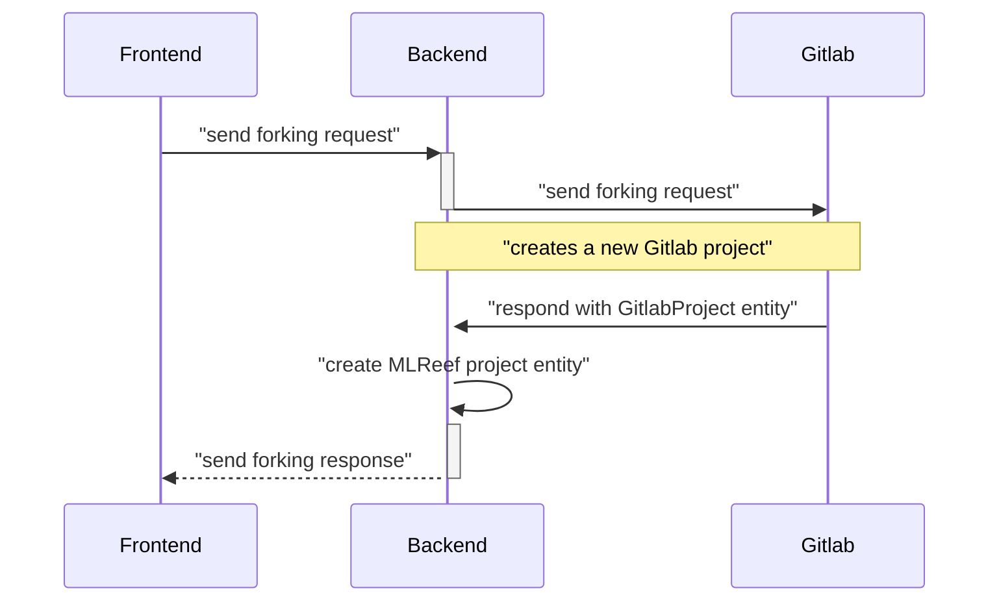
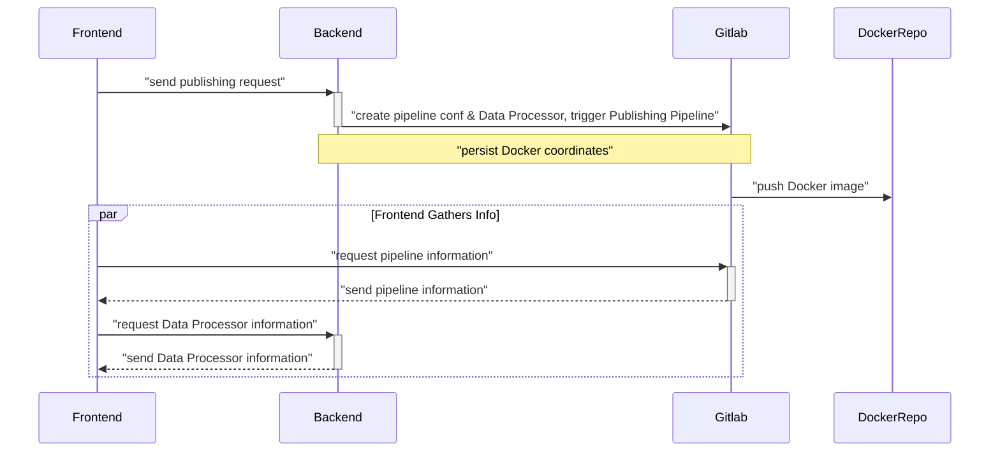

Projects
====================

### Projects Forking
Forking of all projects in MLReef follows the same principles, no matter if a Code Project or a Data Project is forked.

Code Projects
--------------------

### Code Project Publishing
Publishing is the process which packages the code in a project in a way it can later be used by MLReef's Data, Visualisation or Experiment Pipelines. In order to do this the sources are compiled if needed, and the executables are packaged into Docker image and pushed to MLReef's internal Docker registry.

1. The developer initiates publishing of a Data Processor through the Frontend
2. The Backend persists a database object which represents the new version of the Data Processor (DataProcessorVersion)
3. The Backend prepares the `Dockerfile` and pipeline configuration and sends it to Gitlab
