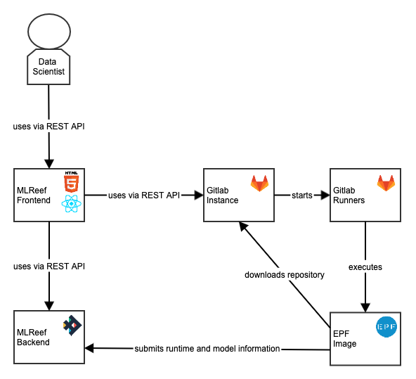

Backend Architecture
==================================

Purpose
----------------------------------
This document provides a comprehensive architectural overview of the MLReef Software as a Service system.
The overview is provided, using a number of different architectural views to depict
different aspects of the system. It is intended to capture and convey the significant
architectural decisions which have been made on the MLReef system.

Architecture and Planning documents for the whole platform.
These diagrams follow the [C4](https://c4model.com/) Style of Software Architecture.

The diagrams are created with the free tool Gliffy. Gliffy is available as Chrome Extension
[here](https://chrome.google.com/webstore/detail/gliffy-diagrams/bhmicilclplefnflapjmnngmkkkkpfad/related?hl=en).

Architecture Goals and Constraints
----------------------------------
There are some key requirements and system constraints that have a significant bearing on the architecture. They are:

- Gitlab was chosen as a Git backend and pipeline workflow engine
- Scaling has to be done in an elastic and cost efficient way 
- Billing of resource usage has to be done on a per client basis.
- Community members have the ability to publish pipeline operations and ML-algorithms
- The MLReef System will be built as a SaaS Web Application.
  The Frontend will be browser based while the backend (Gitlab, additional micro-services and lambda functions)
  will be hosted publicly on the internet.
- The MLReef System must ensure complete protection of data from unauthorized access.
  All remote accesses are subject to user authentication and authorization.
- The pipelines workers must support at least the most common machine learning technologies.
  Currently those include Python and Tensorflow
- A on-premise installation shall be possible

To better understand some of the choices made please read the  [designd decisions documentation](docs/development/design_decisions.md).

Simplified Component Overview
----------------------------------
This is a simplified architecture diagram that can be used to understand MLReef’s architecture.

_Fig 1: container level diagram of the MLReef system architecture_

