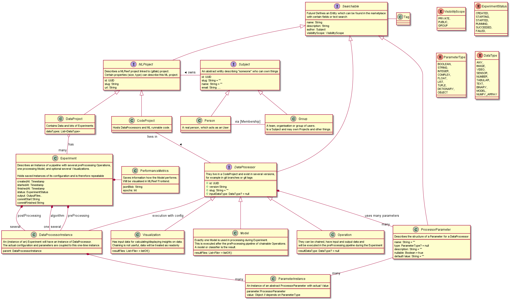

# Domain Model

In order to establish a big picture,
the following model should use names which fulfill our need to understand the context.

## UML Diagram

The following PlantUML export is the current draft and will be kept up-to-date.



## Requirements

### Python Library and EPF

We have to make sure, that users who want to integrate their scripts into the EPF context (during Alpha1 - just us),
have an reliable API and convention to do so

* We should focus on "Developer Happiness" from the beginning. Annotating python files as EPF DataProcessors must be easy.
* Users must have a simple way to declare some basic descriptions
* Users can define their functions as DataProcessors in the MLReef context:
  * DataOperation have at least: inputType, outputType
  * DataVisualisation have at least: inputType
  * DataAlgorithm have at least: outputType
* Parameters:
  * Parameters of Processors must be definable
  * Parameters are important, name, and typ is necessary, the order is not needed, as we use key=value syntax
  * Parameters are nullable = false per default
  * if nullable = true, a defaultValue must be annotated (the python function parameter itself does not need a default value)

From a technical point:
* The python file must be parsable by a Tool (lexical analysis) to extract the meta-information
* meta-information must be stored in the backend:
  * DataProcessors must be created in respect to their owners and visibilityScope
  * DataProcessors must be stored with their DataParameters
  * If a DataProcessor is started, an Instance of DataProcessorInstance is started which has the following:
    * A copy or association with the DataProcessor and its Parameters for this certain point in Time
    * A list of instantiated DataParameterInstances with specific values
    * Constraints:
      * If the config of a DataProcessor gets changed, already existing DataProcessorInstances must not change
      * If a DataParameter changes, already existing DataParameterInstances must not change
      * Therefore, *Instances must associate with a persisted, audited version of the Parameter/Processor (when using SQL)
        or must copy the configuration and store it as a snapshost (when using noSQL)
      * This smells like an UseCase for NoSQL, as we must act on different versions of Parameters/Processors all the time. 
        This would be hard to archive with SQL (imho)
#### Example

```python

@dataOperation(
    name = "Resnet 2.0 Filter",
    author = "MLReef",
    decription = "Transforms images with lots of magic",
    visibility = VisibilityScope.PUBLIC,
    inputType = DataType.IMAGE, 
    outputType = DataType.IMAGE
) 
@parameter(name = "cropFactor", type = ParapeterType.Float) 
@parameter(name = "imageFiles", type = ParapeterType.List) 
@parameter(name = "optionalFilterParam", type = ParapeterType.Integer, nullable = true, defaultValue = 1) 
def myCustomOperationEntrypoint(cropFactor,imageFiles,optionalFilterParam=1): 
    print("stuff happening here") 
    // output is not exported via return, but rather as Files.
    // we have to provide a way to store and chain outputs to the next input
  
myCustomOperationEntrypoint(epfInputArray) 
```
#### Reads

* https://www.geeksforgeeks.org/decorators-with-parameters-in-python/
* https://github.com/antlr/antlr4/blob/master/doc/getting-started.md


## Thoughts & Proposals

* We need a term for stuff like Data Operations, Data Visualisations, and Algorithms.
  * They live in Code Repositories and have many things in common. As they are "things that run in an experiment and process/interpret data" they can be generalized as Data Processors
  * It is still WIP, as e.g. DataOperations and DataVisualisation may behave similar from an API perspective
* Many Entities have global meaning, e.g. a DataOperation "Resnet" and also a one-time instance of that operation like "Apply Resnet with 40x40 params on this data"
  * Those one-time instances will be called *Instance, and are needed for Parameters, DataProcessors and Experiments
  * As Experiments are always Instances, the suffix is omitted.
  * Instances exists in the context of an Experiment, as an Experiment "instantiates" DataOperations and run them in EPF
